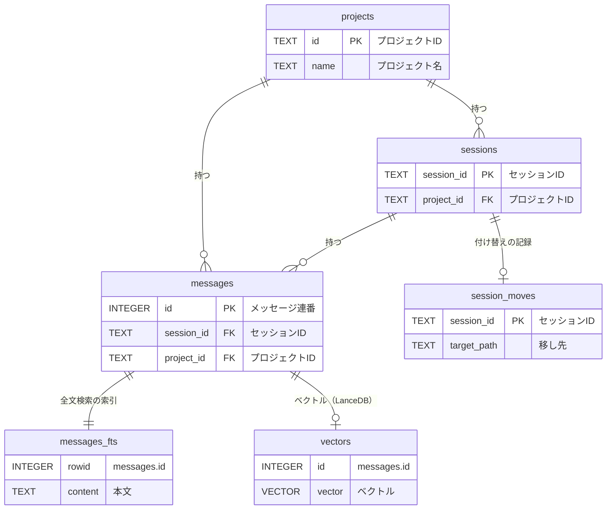

# DB構成

会話の保存に使うテーブルの構成。スキーマの定義は `src/db.ts`（SQLite）と `src/vectors.ts`（LanceDB）にある。DBの場所は保存モードで決まる（[保存モードとデータ](storage.md#保存場所)）。

## 全体図

関連のないテーブル（DB全体の情報）: `meta`、`ingest_state`

- **SQLite**（`conversations.db`）が会話の正本。`vectors` 以外は、すべてここにある
- **LanceDB**（`vectors/`）は意味検索用。SQLiteから作り直せる
- `sessions` を削除すると、その `messages` も一緒に消える（`ON DELETE CASCADE`）。`messages_fts` はトリガーで自動的に追従する

## SQLite

### projects（プロジェクト）

gitリポジトリ1つにつき1行。

| 物理名 | 論理名 | 型 | 役割 |
|---|---|---|---|
| `id` | プロジェクトID | TEXT PK | リポジトリの最初のコミットのハッシュ。名前変更や移動では変わらない |
| `name` | プロジェクト名 | TEXT | 表示用。remoteのリポジトリ名、なければフォルダ名。使うたびに最新に更新 |
| `root_path` | ルートパス | TEXT | 最後に見たリポジトリの場所。コミットの判定に使う |
| `git_remote` | リモート | TEXT | origin のURLを正規化したもの（例: `github.com/foo/app`） |
| `created_at` | 登録日時 | TEXT | 初めて保存した日時 |

### sessions（セッション）

Claude Codeのセッション1つにつき1行。

| 物理名 | 論理名 | 型 | 役割 |
|---|---|---|---|
| `session_id` | セッションID | TEXT PK | Claude Codeのセッションの識別子 |
| `project_id` | プロジェクトID | TEXT FK → projects | どのプロジェクトの会話か |
| `cwd` | 作業ディレクトリ | TEXT | セッション開始時の作業ディレクトリ |
| `git_branch` | ブランチ | TEXT | 最後に記録されたgitブランチ |
| `title` | タイトル | TEXT | Claude Codeが自動で付けたタイトル |
| `started_at` | 開始日時 | TEXT | 最初のメッセージの日時 |
| `updated_at` | 更新日時 | TEXT | 最後のメッセージの日時。一覧の並び順に使う |

### messages（メッセージ）

会話の本文。transcriptの1エントリの、テキストやtool呼び出しのブロック1つにつき1行。

| 物理名 | 論理名 | 型 | 役割 |
|---|---|---|---|
| `id` | メッセージ連番 | INTEGER PK | DBの中での連番。FTSとLanceDBはこれで紐づく |
| `uuid` | メッセージUUID | TEXT UNIQUE | transcriptのuuid。1エントリに複数ブロックあるときは `<uuid>#<番号>` |
| `project_id` | プロジェクトID | TEXT FK → projects | 検索の絞り込みに使う |
| `session_id` | セッションID | TEXT FK → sessions | どのセッションのメッセージか |
| `role` | 発言者 | TEXT | `user` / `assistant` |
| `kind` | 種類 | TEXT | `text` / `tool_use` / `tool_result` |
| `content` | 本文 | TEXT | テキスト。tool系は2000文字で切り詰める |
| `timestamp` | 日時 | TEXT | メッセージの日時（ISO 8601） |
| `cwd` | 作業ディレクトリ | TEXT | そのメッセージのときの作業ディレクトリ |
| `git_branch` | ブランチ | TEXT | そのメッセージのときのgitブランチ |
| `git_commit` | コミット | TEXT | その時刻にブランチで最新だったコミット。最初のコミットより前は NULL |
| `is_sidechain` | サブエージェント | INTEGER | サブエージェントの会話なら 1 |
| `embedded_model` | ベクトル化モデル | TEXT | ベクトルを作った埋め込みモデル。NULL はまだベクトルがない |
| `model` | 応答モデル | TEXT | assistantのメッセージを書いたモデル（例: `claude-opus-5-5`）。userは NULL |

### messages_fts（全文検索の索引）

`messages.content` のキーワード検索用の索引（FTS5、trigram）。日本語の部分一致に対応する。`messages` への追加・削除にトリガーで追従するので、直接は書き込まない。

| 物理名 | 論理名 | 型 | 役割 |
|---|---|---|---|
| `rowid` | メッセージ連番 | INTEGER | `messages.id` |
| `content` | 本文 | TEXT | 検索対象の本文 |

### session_moves（セッションの付け替え）

`move-session` で別のプロジェクトに移したセッションの記録。`rebuild` しても引き継ぐ。`shared` モードでのみ使う。

| 物理名 | 論理名 | 型 | 役割 |
|---|---|---|---|
| `session_id` | セッションID | TEXT PK | 移したセッション |
| `target_path` | 移し先 | TEXT | 移し先のリポジトリのディレクトリ。以降のメッセージもこのプロジェクトに入る |

### meta（DBの情報）

DB自体についての情報を、キーと値で持つ。

| 物理名 | 論理名 | 型 | 役割 |
|---|---|---|---|
| `key` | キー | TEXT PK | 今は `owner_project_id` だけ |
| `value` | 値 | TEXT | `owner_project_id`: `repo` モードのDBの持ち主のプロジェクトID。違うリポジトリからは開けない |

### ingest_state（取り込みの進み具合）

transcriptをどこまで取り込んだか。保存のたびに、続きからだけ読むために使う。

| 物理名 | 論理名 | 型 | 役割 |
|---|---|---|---|
| `transcript_path` | transcriptのパス | TEXT PK | `~/.claude/projects/` の下の `.jsonl` |
| `byte_offset` | 読み込み位置 | INTEGER | 取り込み済みのバイト数 |

## LanceDB

### messages_<埋め込みモデル名>（ベクトル）

テーブル名は埋め込みモデルごと（例: `messages_bge_m3`）。モデルを変えても、ベクトルが混ざらない。対象は `kind = 'text'` のメッセージだけ。

| 物理名 | 論理名 | 型 | 役割 |
|---|---|---|---|
| `id` | メッセージ連番 | INTEGER | `messages.id`。本文はSQLiteから引く |
| `project_id` | プロジェクトID | TEXT | 検索をプロジェクトで絞り込む |
| `session_id` | セッションID | TEXT | 今のセッションの除外と、削除に使う |
| `vector` | ベクトル | float[] | 本文の先頭2000文字の埋め込み。bge-m3なら1024次元 |

## スキーマのバージョン

SQLiteの `user_version` で管理している。

| バージョン | 変更 |
|---|---|
| 2 | プロジェクトIDを最初のコミットのハッシュに。`messages.git_commit` を追加 |
| 3 | `messages.model` を追加。2からは開いたときに自動で移行する |

`meta` は後から足したテーブルだが、`CREATE TABLE IF NOT EXISTS` で作るだけなので、バージョンは上げていない。
